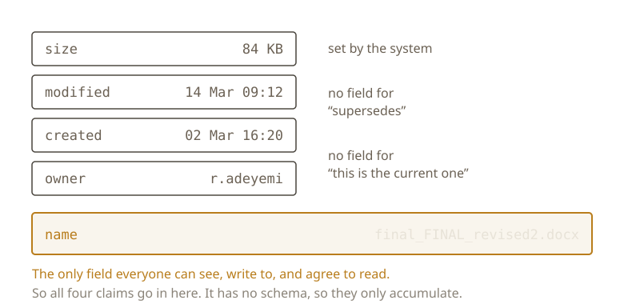

{/* _class: impact */}

# final_FINAL_revised2.docx

Not written by someone who doesn't understand version control.

---

```text
report.docx
report_v2.docx
final.docx
final_FINAL.docx
final_FINAL_revised2.docx
```

---

## One string, four claims

- **Supersession:** this replaces `final.docx`
- **Sequence:** a second round happened; there was a first
- **Currency:** as of now, this is the one to use
- **Finality:** `final`, twice, asserting nothing further is coming

No supersedes field. No current flag. No round counter.

---

## So it all goes in the name



---

## The mechanism explains the shape

No schema: a claim can't be corrected, only appended to. The strings grow
rightward and never shrink.

No authority: `final` is a claim, not a guarantee.

No exclusivity: anyone can file a competing claim in the same field.

---

## Two different things

**Versioning:** tracking what's current. As old as revision itself.

**Version control:** software that does it automatically. About sixty
years old.

Most people writing documents have never opened the second one.

---

{/* _class: quote */}

> This week is about what people do in its absence.

---

## Next week

What a file actually is, underneath the name someone gave it.

Then: why anyone needs to write `revised2` to say so.

---

{/* _class: sources */}

## Sources

- <cite>How Do People Organize Their Desks? Implications for the Design of Office Information Systems</cite>
  <span class="ref-meta">Thomas W. Malone, *ACM Transactions on Office Information Systems* 1(1), 1983, 99–112.
  The study that named filers and pilers, and found that an organising scheme is used
  to remind as much as to retrieve.</span>
  [dl.acm.org](https://dl.acm.org/doi/10.1145/357423.357430)

```notes
Malone is the empirical backing for the claim that this is not a discipline
failure. People organise around what their tools make cheap. Worth saying that
the study is from 1983 and describes physical desks. The behaviour predates
the filesystem, which is the point.
```
