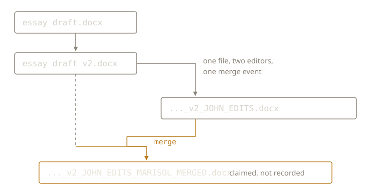

{/* _class: impact */}

# Save As

`_v2`, then `_JOHN_EDITS`, then `_MARISOL_MERGED`.

Nobody would call this branching. It's branching.

---

## What a real branch gives you

- a record of where it diverged
- an identity distinct from the filename
- a mechanical diff against its origin
- a merge operation that mostly works automatically

None of this comes from typing `_v2`.

---

## The substitutes

The divergence point: whatever someone remembers.

The diff: reading both documents side by side.

The merge: retyping one person's changes into the other's file.

Three of the four substitutes are memory. Memory is not shared storage.

---

## The graph is legible



You can reconstruct this from the folder listing alone.

---

## What it can't tell you

Whether it's true.

`MARISOL_MERGED` records that a merge was claimed. Not that one was
performed, and not from which copy.

---

{/* _class: quote */}

> Merge conflict, as a lived experience, predates the term — discovered only
> when someone compares the files by eye and finds they disagree.

---

## Next week

None of this is new. People managed divergent copies for centuries before
any of it ran on a computer.

What did they actually do?

---

{/* _class: sources */}

## Sources

- <cite>RCS — A System for Version Control</cite>
  <span class="ref-meta">Walter F. Tichy, *Software: Practice and Experience* 15(7), 1985, 637–654.
  Organises revisions into an ancestral tree rooted at the initial revision — the same
  structure the filename chain implies, recorded by the system that performed the
  operations rather than by the people who did.</span>
  [wiley](https://onlinelibrary.wiley.com/doi/abs/10.1002/spe.4380150703) ·
  [free PDF](https://docs-archive.freebsd.org/44doc/psd/13.rcs/paper.pdf)

```notes
Tichy is here for the phrase "ancestral tree," not for RCS as a tool. The
contrast to draw: RCS records the tree as a consequence of the operations,
so it cannot disagree with what happened. The folder records it as a set of
assertions typed afterwards, so it can.
```
