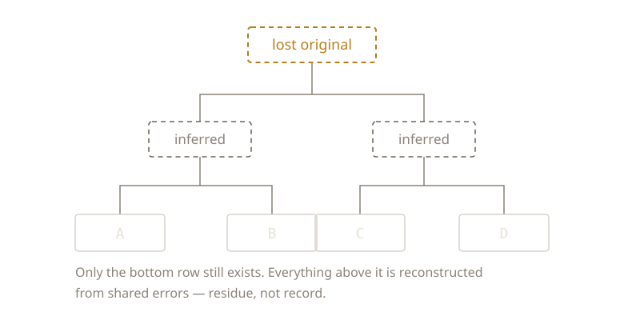

{/* _class: impact */}

# Before Git

Git is sixty years younger than the problem it solves.

---

## Scribal copying

Every hand-copied manuscript introduces errors.

Textual critics reconstruct a lost original by comparing surviving copies:
the same operation as diffing branches to find a common ancestor.

---



---

## Carbon paper

A duplicate made at the moment of writing, not after.

The mechanical ancestor of a commit.

---

## Redlining / Track Changes

Every insertion and deletion marked and attributed.

A diff format, authored by hand, decades before software formalised one.

---

## RCS, SCCS

1970s–80s. Store a base version. Record each change as a delta. Tag it with
an author and a timestamp.

No new idea. First time a computer did the bookkeeping.

---

{/* _class: quote */}

> Only the cost of solving the problem properly dropped.

---

## What did not change

Every one of these records that a change happened, and who made it.

Not one decides whether the change was an improvement, or which variant
reading the author intended.

The bookkeeping was automated. The adjudication was not.

---

## Next week

There's a formal record of changes now.

How does a machine actually compare two versions?

---

{/* _class: sources */}

## Sources

- <cite>The Source Code Control System</cite>
  <span class="ref-meta">Marc J. Rochkind, *IEEE Transactions on Software Engineering* SE-1(4), 1975, 364–370.
  SCCS: the first system to record, automatically, who made each change, when, and why.</span>
  [dl.acm.org](https://dl.acm.org/doi/10.1109/TSE.1975.6312866)
- <cite>RCS — A System for Version Control</cite>
  <span class="ref-meta">Walter F. Tichy, *Software: Practice and Experience* 15(7), 1985, 637–654.
  Stores each revision as a delta against its neighbour: the carbon-paper idea, costed
  out in disk blocks.</span>
  [free PDF](https://docs-archive.freebsd.org/44doc/psd/13.rcs/paper.pdf)

```notes
Rochkind's own list is the useful quote: who, when, where, why. Every one of
those was previously a thing a person remembered. Note the fifty-year gap
between the practices at the start of this deck and the software at the end,
and that nothing in the list is a new idea, only newly automatic.
```
