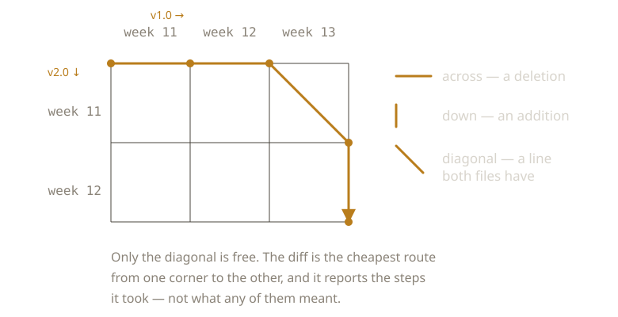

{/* _class: impact */}

# The Diff

A machine cannot see that you rewrote a paragraph.

It sees lines present in one file and absent in the other.

---

## What it computes

The longest sequence of lines the two versions share, in order.

Left over on the left: deletions. Left over on the right: additions.

---



---

## There is no third category

A modified line is a deletion and an addition sitting next to each other.

The tool has no concept of modification.

---

## Consequences

- Moved text reads as deleted and re-added
- Reflowing a paragraph changes every line in it
- A typo fix and a full rewrite look identical
- More than one diff of the same two files can be correct

---

## Legible because mechanical

It reports what it observed, with no interpretation.

That is what makes it trustworthy.

---

## And empty as a judgement

It can't say which side is right — neither is wrong in any sense available
to it.

It can't say which change matters — significance isn't a property of a line.

It can't say why — intent was never in the file.

---

{/* _class: quote */}

> Complete as a report. Empty as a judgement.

---

## Next week

The diff shows exactly what differs and nothing about what to keep.

Next: a system that tries to resolve it anyway, and has to stop.

---

{/* _class: sources */}

## Sources

- <cite>An Algorithm for Differential File Comparison</cite>
  <span class="ref-meta">J. W. Hunt and M. D. McIlroy, Bell Labs Computing Science Technical Report 41, 1976.
  The report behind Unix `diff`. States the job plainly: find the lines that do not change,
  by solving the longest common subsequence problem.</span>
  [cs.dartmouth.edu](https://www.cs.dartmouth.edu/~doug/diff.pdf)
- <cite>An O(ND) Difference Algorithm and Its Variations</cite>
  <span class="ref-meta">Eugene W. Myers, *Algorithmica* 1(2), 1986, 251–266. Recasts the problem as a
  shortest path through an edit graph — the diagram earlier in this deck. Still the
  algorithm most diff tools run.</span>
  [doi.org](https://doi.org/10.1007/BF01840446)

```notes
Both papers describe what the comparison computes and neither claims it means
anything. That is the week's argument, made by the primary sources rather than
by me. If asked why diffs disagree between tools: more than one common
subsequence can be longest, and the papers pick different ones.
```
