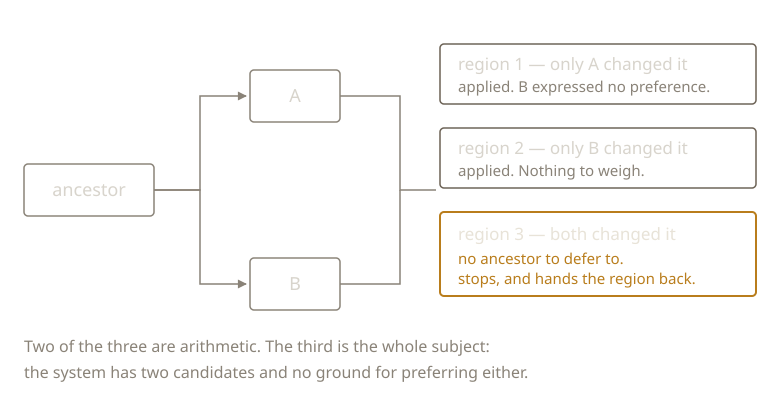

{/* _class: impact */}

# Merge Conflict

Not an error.

A system reporting that it has reached a decision it has no basis to make.

---

## Most of a merge is arithmetic

Common ancestor, two descendants. For each region: did one side change it,
both, or neither?

One side changed it, the other didn't: apply it. No preference expressed,
nothing to weigh.

---



---

## The one hard case

Both sides changed the same region, differently.

Two candidate texts. No ancestor to defer to. No ground to prefer either.

---

```text
<<<<<<< HEAD
the committee reviewed the findings
=======
the committee noted the findings
>>>>>>> revision
```

---

## Not stylistic variants

*Reviewed* and *noted* make different claims about what the committee did.

One of them becomes what the record says happened.

---

## Three properties the tooling conceals

- **Lossy:** the discarded version goes nowhere a reader will find
- **Unattributed:** the file records who merged, not who was overruled
- **Unexplained:** no format has a field for why

---

{/* _class: quote */}

> A resolved merge looks exactly like text that was never contested.

---

## Next week

Someone decided. The file reads as though there was never a question.

What entitled them?

---

{/* _class: sources */}

## Sources

- <cite>A State-of-the-Art Survey on Software Merging</cite>
  <span class="ref-meta">Tom Mens, *IEEE Transactions on Software Engineering* 28(5), 2002, 449–462.
  Surveys merging from purely textual through syntactic to semantic techniques. The
  further up that ladder a tool climbs, the more it can combine. No rung reaches
  intent.</span>
  [dl.acm.org](https://dl.acm.org/doi/10.1109/TSE.2002.1000449)
- <cite>A Formal Investigation of Diff3</cite>
  <span class="ref-meta">Sanjeev Khanna, Keshav Kunal and Benjamin C. Pierce, *FSTTCS 2007*, LNCS 4855, 485–496.
  Takes the de facto standard merge algorithm and checks its intuitive properties. Several
  turn out to be false in general.</span>
  [cis.upenn.edu](https://www.cis.upenn.edu/~bcpierce/papers/diff3-short.pdf)

```notes
The Khanna paper is the honest one to cite here: people assume edits to
well-separated regions never conflict, and formalising that assumption is
delicate. Useful against the objection "surely a better tool would just handle
it": better tools handle more, and the remaining case is not a tooling gap.
```
