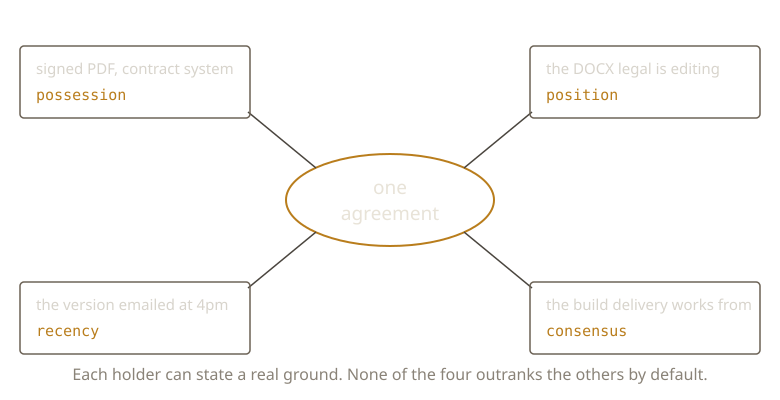

{/* _class: impact */}

# The Canonical Version

Who gets to say which copy is real?

---

## Not a technical fact

A hash test can't settle this. Neither can a timestamp.

Canonicity is a claim about authority.

---

## Four grounds

- Possession — whoever holds the master copy
- Position — whoever's role entitles them to decide
- Recency — whoever edited last
- Consensus — whoever most people currently defer to

---

## The weak one

Recency is the most commonly used ground.

It is also the weakest. A timestamp is not a judgement.

---

## One agreement, four copies

```text
signed PDF in contract system   possession
the DOCX legal is editing       position
the version emailed at 4pm      recency
the build delivery works from   consensus
```

Each holder can state a real ground.

---



---

## They conflict

The most recent edit isn't authoritative if the editor lacked standing.

Possession can lose to a court's reading of a different copy.

---

{/* _class: quote */}

> Identity is a fact about files. Authority is a fact about people, and it
> has to be argued for.

---

## Someone formalised this

Diplomatics — a seventeenth-century science, built to decide whether a charter
was genuine.

Its modern descendants define an authentic record as one that *is what it
purports to be*, and make that a presumption you argue for from evidence,
not a property you read off the document.

---

## Next week

A human applies these grounds with judgement, case by case.

What happens when a machine has to decide, automatically, with no human to ask?

---

{/* _class: sources */}

## Sources

- <cite>Diplomatics: New Uses for an Old Science, Part I</cite>
  <span class="ref-meta">Luciana Duranti, *Archivaria* 28, 1989, 7–27. Diplomatics began as a method for
  proving whether a document was genuine, and supplies the vocabulary this week borrows
  for arguing authority from evidence.</span>
  [archivaria.ca](https://archivaria.ca/index.php/archivaria/article/view/11567)
- <cite>Requirements for Assessing and Maintaining the Authenticity of Electronic Records</cite>
  <span class="ref-meta">InterPARES Project, Authenticity Task Force, 2002. Treats authenticity as a
  presumption supported cumulatively by evidence — closer to this week's four grounds
  than to any test a file can pass.</span>
  [interpares.org](https://www.interpares.org/book/interpares_book_d_part1.pdf)

```notes
Worth stating that these come from archival science, not computing. The
records profession reached the conclusion first because it had to: courts
demanded it. If a student objects that this is all soft, the answer is that
it is the standard evidence is actually held to.
```
