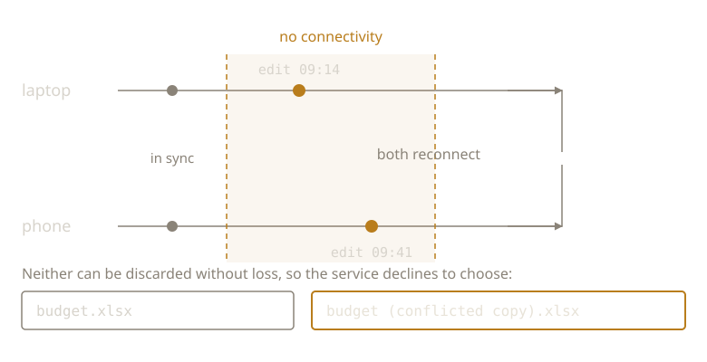

{/* _class: impact */}

# Sync Is a Lie

"In sync" is a status message, not a state.

---

## What it actually means

As of the last successful exchange, no device reported anything the service
couldn't reconcile.

Not: the devices currently hold the same bytes.

---

## The hard constraint

A sync service cannot ask you.

It decides immediately, using a timestamp, on clocks that don't agree.

---

## Last week's four grounds

- Possession — meaningless, every device has a copy
- Position — unknowable, the service doesn't know who your supervisor is
- Consensus — can't be polled
- Recency — the only one left

---

## So it uses recency

Which is why it is wrong on a predictable schedule.

---



---

```text
budget.xlsx
budget (Marisol's conflicted copy 2027-04-14).xlsx
```

Not a malfunction. The service declining a decision it has no authority to
make.

---

## The failure is downstream

Nobody reads the conflict copy.

It looks like litter rather than a finding.

---

## It is not a bad service

Under a network partition, no system can be both fully consistent and fully
available. That is a proved result, not a product decision.

The conflict copy is what choosing availability looks like from inside your
folder.

---

## Next week

A conflict copy preserves both versions intact.

Next: loss with nothing duplicated and nothing overwritten.

---

{/* _class: sources */}

## Sources

- <cite>Time, Clocks, and the Ordering of Events in a Distributed System</cite>
  <span class="ref-meta">Leslie Lamport, *Communications of the ACM* 21(7), 1978, 558–565. Why "which
  happened later" is not a question separate machines can answer from their own clocks.</span>
  [dl.acm.org](https://dl.acm.org/doi/10.1145/359545.359563)
- <cite>Brewer's Conjecture and the Feasibility of Consistent, Available, Partition-Tolerant Web Services</cite>
  <span class="ref-meta">Seth Gilbert and Nancy Lynch, *ACM SIGACT News* 33(2), 2002, 51–59. The proof
  that under partition a service gives up consistency or availability. Your conflict copy
  is that trade-off, itemised.</span>
  [dl.acm.org](https://dl.acm.org/doi/10.1145/564585.564601)

```notes
Do not let this land as "sync is badly built." Lamport says ordering is not
recoverable from local clocks; Gilbert and Lynch say the trade-off is forced.
The service is behaving correctly. The failure this week identifies is
downstream and human: nobody opens the conflict copy.
```
