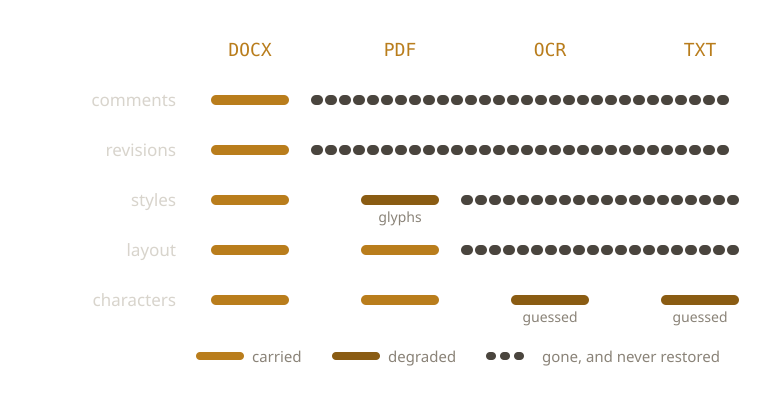

{/* _class: impact */}

# Conversion Damage

Last week: two files, one named as the loser.

This week: one file, correctly named, opening fine, missing things.

---

## The chain

```text
DOCX  →  PDF  →  OCR  →  TXT
```

Comments, then layout, then characters, then structure.

---

## What each format can hold

```text
              comments  revisions  styles  layout  characters
DOCX             yes       yes      yes     flow    authored
PDF               no        no    glyphs    fixed   authored
PDF + OCR         no        no       no      no     guessed
TXT               no        no       no      no     guessed
```

Read down any column. It only ever degrades.

---



---

## Nothing reports a failure

Every step produced a valid file in a valid format.

No step recorded what it dropped.

---

## Losses don't cancel

The second step can no longer tell an authored character from an artefact
the first step introduced.

---

## Round-tripping

DOCX → PDF → OCR → DOCX.

Original extension. Original application. Fails every week-2 identity test.

---

## How wrong does OCR get?

In large newspaper digitisation programmes, practitioners treat above 98%
character accuracy as good, 90–98% as average, below 90% as poor.

90% character accuracy is roughly one wrong character per ten. Nothing in
the output marks which ten.

---

## Next week

A history that is real but unrecorded.

Next: doing that work backwards.

---

{/* _class: sources */}

## Sources

- <cite>How Good Can It Get? Analysing and Improving OCR Accuracy in Large Scale Historic Newspaper Digitisation Programs</cite>
  <span class="ref-meta">Rose Holley, *D-Lib Magazine* 15(3/4), 2009. Source of the good / average / poor
  accuracy bands, from the Australian Newspapers Digitisation Program.</span>
  [dlib.org](https://www.dlib.org/dlib/march09/holley/03holley.html)
- <cite>Ensuring the Longevity of Digital Documents</cite>
  <span class="ref-meta">Jeff Rothenberg, *Scientific American* 272(1), 1995, 42–47. Argues that the
  readable copy and the faithful copy come apart, and that migration is a choice about
  which losses to accept.</span>
  [scientificamerican.com](https://www.scientificamerican.com/article/ensuring-the-longevity-of-digital-d/)

```notes
The accuracy bands are the number to leave people with. "Good" OCR still
means a wrong character every fifty or so, and the error is silent — the TXT
does not mark its guesses. That is the difference between a lossy step and a
step that reports its losses.
```
