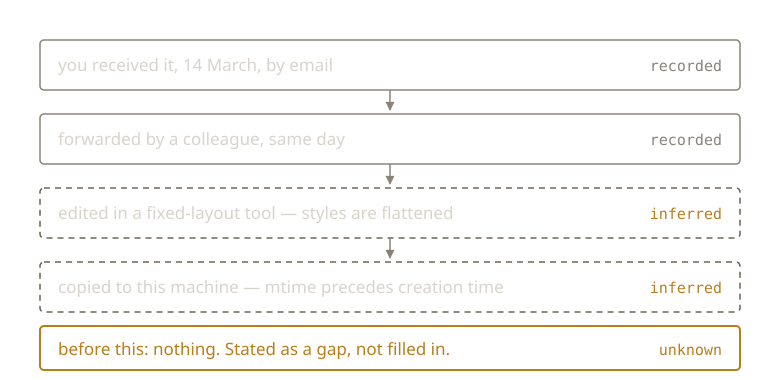

{/* _class: impact */}

# Provenance & Forensics

A folder of artefacts and no log.

The normal condition, not a special case.

---

## Residue, not proof

- **mtime before creation time:** copied here, not authored here
- **an embedded application version:** an edit placed within a range of
  years, sometimes an organisation's licence
- **flattened styles:** passed through a fixed-layout format, whatever the
  extension claims
- **a departed colleague's name in a filename:** who held it, and roughly
  when

---

## Nobody curated any of it

Which is exactly what makes it useful.

---

## And all of it is defeasible

Timestamps can be set. Metadata can be stripped by a tool with no opinion
about it.

A reconstruction that doesn't say what it's unsure of is a story.

---

## Archivists got here first

**Provenance:** keep records grouped by who created them, not
reorganised by subject.

**Chain of custody:** record every transfer, so a gap reads as a gap.

---



---

## 1898

Three Dutch archivists publish a hundred rules for arranging archives.

Rule one, in effect: an archive is a product of its creator, and regrouping it
by subject destroys evidence you cannot rebuild.

Endorsed internationally in 1910. Still the working principle.

---

## Both say one thing

The history of a thing is part of the thing.

It cannot be reconstructed reliably once discarded.

---

{/* _class: quote */}

> Git did not invent an approach to provenance. It mechanised one that had
> been written down for a century.

---

## Next week

Provenance answers what happened.

It doesn't answer what to keep.

---

{/* _class: sources */}

## Sources

- <cite>Handleiding voor het Ordenen en Beschrijven van Archieven</cite>
  <span class="ref-meta">S. Muller, J. A. Feith and R. Fruin, 1898; translated by Arthur H. Leavitt as
  *Manual for the Arrangement and Description of Archives*, 1940. The hundred rules that
  codified provenance and original order. Print; no stable public copy to link.</span>
- <cite>Archival Theory and the Dutch Manual</cite>
  <span class="ref-meta">Eric Ketelaar, *Archivaria* 41, Spring 1996, 31–40. Traces the Manual back to French
  *respect des fonds* and the German *Registraturprinzip*, and forward into practice.</span>
  [archivaria.ca](https://archivaria.ca/index.php/archivaria/article/view/12123)
- <cite>Digital Forensics and Born-Digital Content in Cultural Heritage Collections</cite>
  <span class="ref-meta">Matthew Kirschenbaum, Richard Ovenden and Gabriela Redwine, CLIR publication 149, 2010.
  What happens when archivists adopt the evidentiary methods of forensics: including the
  ethics of reading residue a donor never meant to hand over.</span>
  [clir.org](https://www.clir.org/wp-content/uploads/sites/6/pub149.pdf)

```notes
The CLIR report is the one to flag for the lab: it takes seriously that
residue is evidence its author did not choose to leave, and that this cuts
both ways. Students reading a colleague's metadata should meet that argument
before they enjoy it too much.
```
